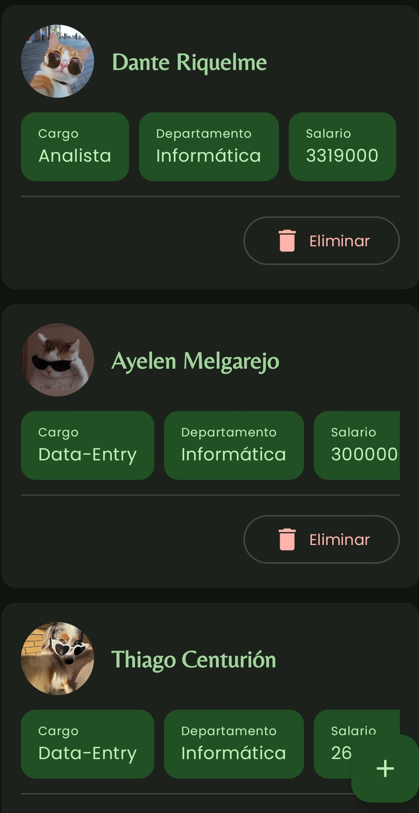
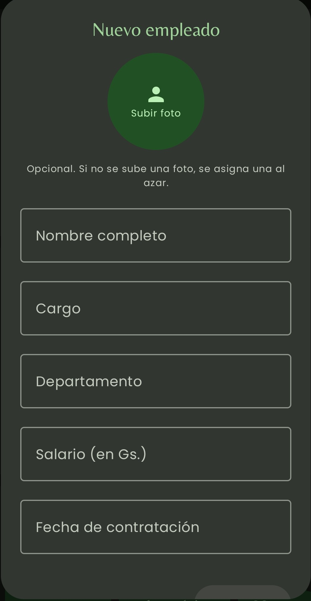
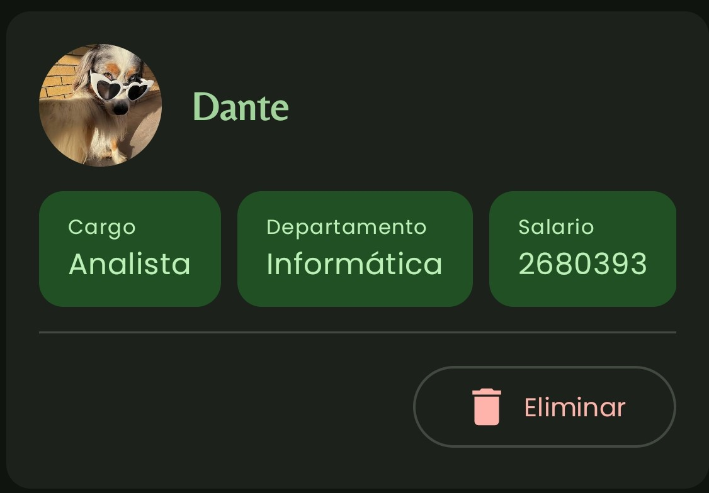
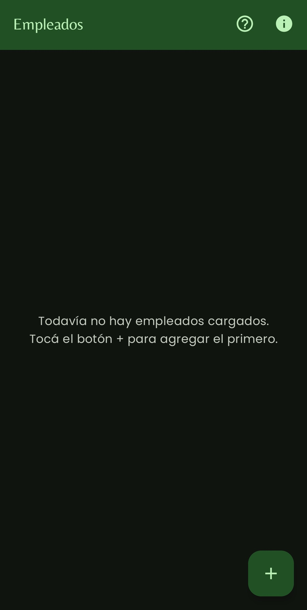
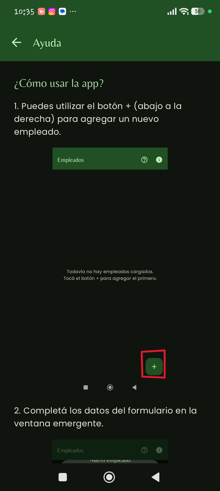
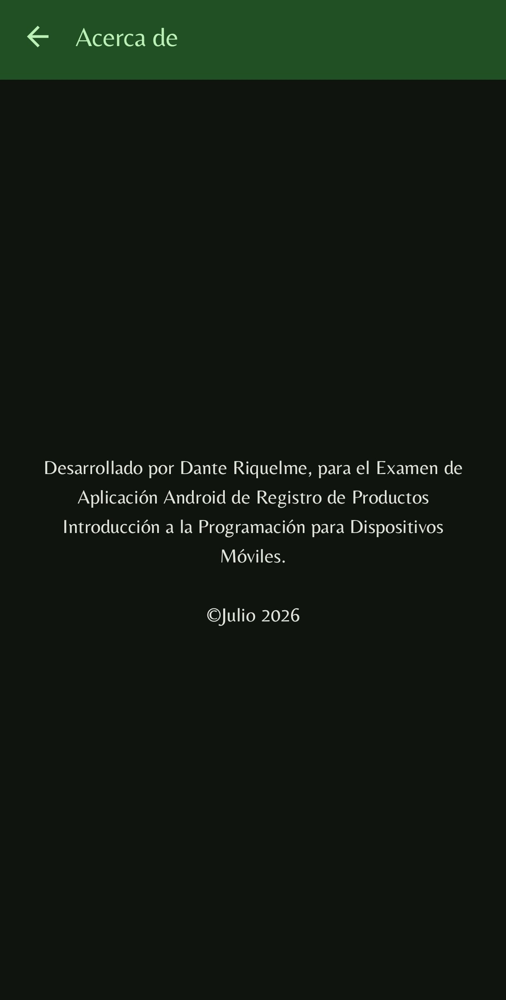
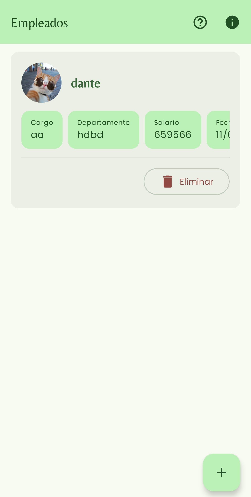
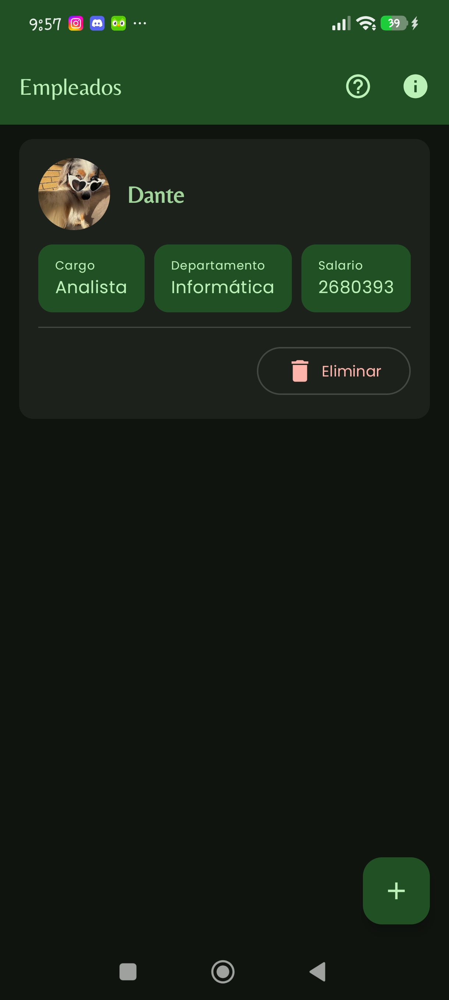

# Registro de Empleados

Aplicación Android para gestionar el registro de empleados de una empresa: alta, listado y eliminación de empleados, con foto de perfil, tema claro/oscuro y una interfaz construida íntegramente con **Jetpack Compose**.

> Trabajo desarrollado para el examen final de **232 - Introducción a la Programación para Dispositivos Móviles**.

---

## Objetivo

Desarrollar una aplicación Android que permita registrar empleados con su nombre, cargo, departamento, salario y fecha de contratación, mostrándolos en una lista y permitiendo eliminarlos individualmente.

---

## Características

- **Alta de empleados** desde un formulario en una ventana emergente (Dialog), accesible con un botón flotante (+).
- **Foto de perfil** por empleado: se puede subir una imagen desde la galería y, si no se sube ninguna, se asigna automáticamente una foto de respaldo (perritos y gatos) alternando entre una y otra.
- **Listado** con `LazyColumn`; cada tarjeta muestra la foto junto al nombre y un `LazyRow` con el resto de los datos.
- **Eliminación** individual mediante el botón "Eliminar" de cada tarjeta.
- **Validación de campos**: el salario acepta solo números y la fecha de contratación exige el formato `DD/MM/AAAA` (valida días y meses reales).
- **Tema personalizado** hecho con Material Theme Builder, con soporte para modo **claro** y **oscuro**.
- **Pantalla de Ayuda** con una guía paso a paso y **pantalla Acerca de**.
- **Registro del ciclo de vida** de la Activity (`onCreate`, `onStart`, `onStop`, `onDestroy`) en Logcat.

---

## Vista previa

| Lista de empleados | Alta de empleado | Detalle de tarjeta |
| :---: | :---: | :---: |
|  |  |  |

| Lista vacía | Pantalla Ayuda | Pantalla Acerca de |
| :---: | :---: | :---: |
|  |  |  |

| Tema claro | Tema oscuro |
| :---: | :---: |
|  |  |

---

## Tecnologías

- **Lenguaje:** Kotlin
- **UI:** Jetpack Compose + Material 3
- **Carga de imágenes:** Coil
- **Tema:** Material Theme Builder (claro y oscuro)

---

## Estructura del proyecto

```
app/src/main/
├── java/com/example/registroempleadosdanteriquelme/
│   ├── MainActivity.kt        # Activity, ciclo de vida y toda la UI (Compose)
│   ├── data/
│   │   └── Empleado.kt        # Modelo de datos del empleado
│   └── ui/theme/
│       ├── Color.kt           # Paleta de colores (claro + oscuro)
│       ├── Theme.kt           # Tema Material 3 (AppTheme)
│       └── Type.kt            # Tipografía
└── res/
    └── drawable/              # Imágenes: pet1..pet4 y ayuda1..ayuda5
```

---

## Requisitos y dependencias

En `app/build.gradle.kts`:

```kotlin
implementation("io.coil-kt:coil-compose:2.7.0")
implementation("androidx.compose.material:material-icons-extended")
```

Imágenes necesarias en `app/src/main/res/drawable/` (nombres en minúscula, sin espacios):

- `pet1`, `pet2`, `pet3`, `pet4` → fotos de respaldo.
- `ayuda1` a `ayuda5` → capturas para la pantalla de Ayuda.

---

## ▶️ Cómo ejecutar

1. Clonar el repositorio y abrr el proyecto en **Android Studio**.
2. Esperar a que **Gradle** sincronice las dependencias.
3. Agregar las imágenes indicadas en `res/drawable/`.
4. Elegir un emulador o conectar un dispositivo físico.
5. Presionar **Run ▶** (o `Shift + F10`).

---

## 🔄 Ciclo de vida de la Activity

La Activity principal sobrescribe `onCreate`, `onStart`, `onStop` y `onDestroy`, y registra un mensaje en cada uno. Para verlo:

1. Abrí **Logcat** en Android Studio.
2. Filtrá por el tag `MainActivity`.
3. Abrí, mandá a segundo plano y cerrá la app para ver los distintos mensajes.

---

## Tema claro / oscuro

El tema es personalizado (generado con Material Theme Builder) y responde automáticamente al modo del sistema. Para probarlo, cambiá el modo oscuro en los ajustes del emulador o dispositivo.

---

## Autor

Desarrollado por **Dante Riquelme** — © Julio 2026.
Examen final de *Introducción a la Programación para Dispositivos Móviles*.
